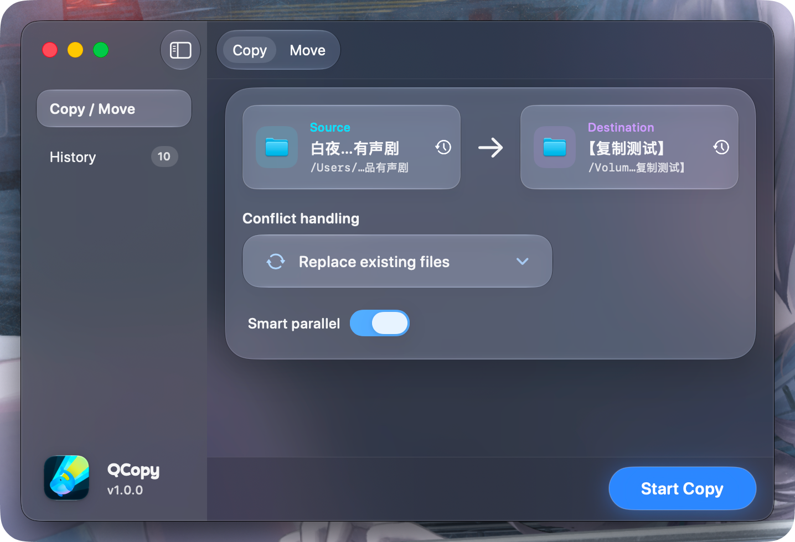
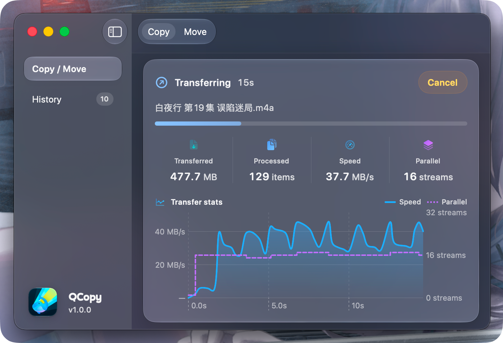
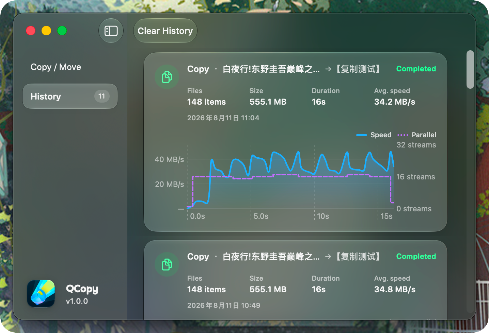

<div align="center">
  
  <h1>QCopy</h1>
  <p>一款快速、安全、原生的 macOS 文件复制与移动工具。</p>

  [下载最新版本](https://github.com/qzrzz/QCopy/releases) · [更新日志](CHANGELOG.md) · [开发与发布](RELEASE.md)
</div>

## 为什么选择 QCopy

Finder 在处理大量文件、外置磁盘或 NAS 时，可能需要较长的“准备”时间。QCopy 边枚举边传输，不在开始前扫描整棵目录树，让任务更快进入实际复制阶段，并持续展示当前文件、速度和并发状态。

## 功能

- 文件与文件夹复制、移动，支持拖放选择来源和目标
- 智能并发：根据文件大小与实时吞吐自动调整并发数
- 冲突处理：覆盖、跳过或自动重命名
- 安全覆盖：先写入临时文件，成功后再原子替换目标
- 同卷移动优先使用快速重命名，跨卷时自动回退到复制后删除
- 尽可能利用 APFS clone，并保留文件元数据与稀疏文件特性
- 实时展示当前文件进度、传输速度、并发数和统计图表
- 最近路径与操作记录本地持久化
- 完成通知、任务取消与移动操作防误触保护
- 简体中文 / English，支持浅色、深色和跟随系统外观
- 原生 SwiftUI 与 Liquid Glass 风格界面

## 界面预览

<p align="center">
  
</p>

<p align="center">
  
  
</p>

## 系统要求

- macOS 26.0 或更高版本
- 从源码构建：Xcode 26、[XcodeGen](https://github.com/yonaskolb/XcodeGen) 与 [Bun](https://bun.sh/)

## 从源码运行

```bash
git clone https://github.com/qzrzz/QCopy.git
cd QCopy
bun install
bun run dev
```

`bun run dev` 会重新生成 Xcode 工程、构建 Debug 版本，并启动 `QCopy Dev.app`。也可以直接用 Xcode 打开 `QCopy.xcodeproj`，选择 `QCopy` scheme 运行。

## 常用命令

```bash
bun run dev       # 构建并运行 Debug 版本
bun run debug     # 使用 Instruments 调试
bun run build     # 构建并打包本地 Release DMG
bun run clean     # 清理构建产物
```

运行测试：

```bash
xcodegen generate
xcodebuild \
  -project QCopy.xcodeproj \
  -scheme QCopy \
  -configuration Debug \
  -derivedDataPath build/DerivedData \
  test
```

版本更新、签名、公证和 GitHub Release 发布说明见 [RELEASE.md](RELEASE.md)。

## 官网开发

产品官网位于 `web/`，使用 Vite、React 和 TypeScript 构建：

```bash
cd web
bun install
bun run dev
```

执行 `bun run build` 会生成英文与简体中文静态页面，并同步到根目录的 `docs/`，用于 GitHub Pages。

## 项目结构

```text
QCopy/          macOS SwiftUI 应用与复制引擎
QCopyTests/     复制安全与网络卷集成测试
web/            产品官网源码
docs/           官网静态构建产物
scripts/        版本和清理脚本
project.yml     XcodeGen 工程配置
release.ts      Release 构建、签名、公证与发布脚本
```

## 设计原则

QCopy 不预先计算整个任务的总大小，因此界面展示的是当前文件进度和已完成统计，而不是一个可能长时间停留在“准备中”的虚假整体进度。移动操作还会拒绝系统敏感目录、用户主目录和磁盘根目录等高风险来源。

欢迎通过 [Issues](https://github.com/qzrzz/QCopy/issues) 报告问题或提出建议。
